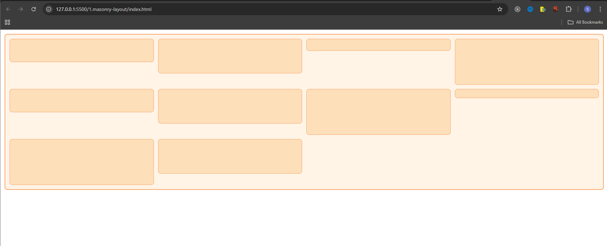

# Masonry Layout with HTML and CSS

## 🚀 Usage

To view the project:

1. Clone or download the repository.
2. Open the `index.html` file in a browser.

---

## 🛠️ How It Works

1. **CSS Grid**: The layout is created using CSS Grid with the `grid-template-columns` property, which ensures that no more than four items are displayed per row. The `repeat(4, 1fr)` rule limits the grid to four equal-width columns.
2. **Masonry Layout**: The `grid-auto-rows` property creates a masonry effect, where items stack based on their height and fill the available space in the grid container.

---

## 🖼️ ScreenShot

---

[<- All Assignments](../readme.md)