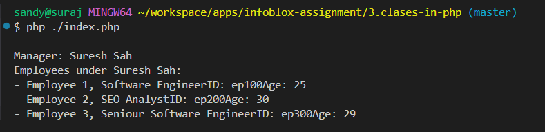

# Clases in php

## 🚀 Usage
### Running the Example

1. Clone or download the repository.
2. Ensure you have PHP installed on your system.
3. Open a terminal, navigate to the project directory (clases-in-php), and run:
   ```
      php index.php
   ```
4. The example code in `index.php` will demonstrate the usage of the `Person`, `Manager`, and `Employee` classes.

---

## 🖼️ ScreenShot


---

[<- All Assignments](../readme.md)
