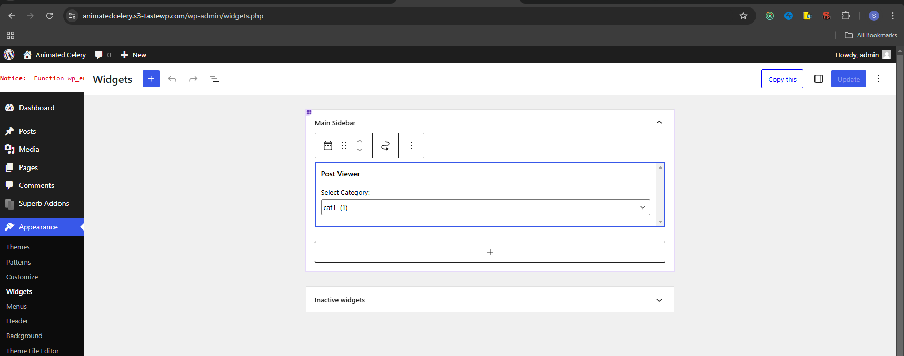
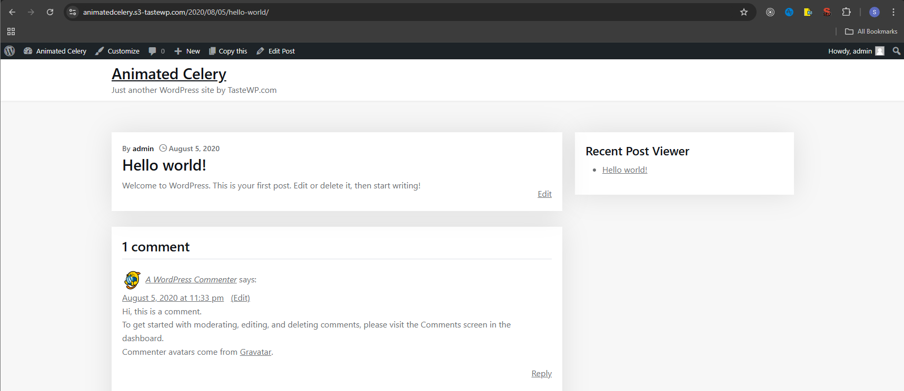

# Post viewer wordpress plugin

## 🚀 Usage
- Upload the posts-viewer.zip using upload plugin option in wordpress and activate it.
- If the theme supports widget then the plugin will be available in the Apperance>Widget section as `Post Viewer`.
---
---
---
---
---
---

## 🖼️ ScreenShot
- Edit Post viewer widget in Editor

- View Widget in posts 

---